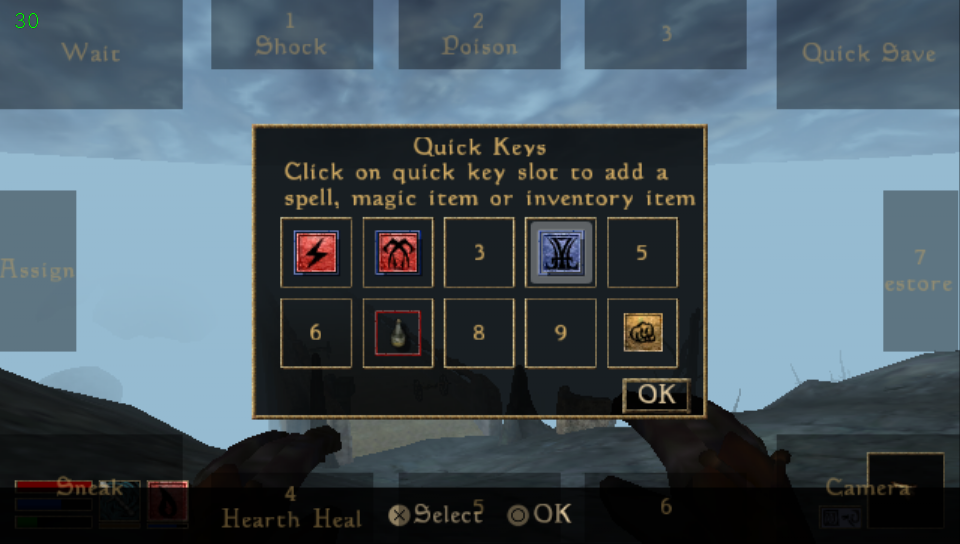

PS Vita Port
------------

Full port of OpenMW to PS Vita via [vitaGL](https://github.com/Rinnegatamante/vitaGL). Runs Morrowind, Tribunal, and Bloodmoon at 20–30 FPS with controller input and a front touchscreen cursor.

Exterior cells stream in seamlessly around you — no loading screens at cell borders. The world hydrates by distance (structures first, then clutter, actors, and physics as you approach), paced against a target framerate so streaming spends spare frame time instead of causing hitches. A warm-asset system keeps commonly used models, body parts, and weather assets preloaded per region so things appear when they should. Loading screens remain for interiors, teleports, and fast travel.

Ships with the Morrowind Optimization Patch and Project Atlas baked in, a dynamic fog system that scales draw distance to hold framerate, and a memory-management layer (heap defrag, texture tier-down, cache pressure relief) tuned to the Vita's RAM budget.

AI Usage: AI Assisted (build system detangling, streaming/performance investigation and tuning, analysis.)

### Installation

- Install `openmw.vpk` on your Vita using VitaShell
- Copy your Morrowind game data to `ux0:data/openmw/Data Files/`:
  - `Morrowind.esm`, `Morrowind.bsa`
  - `Tribunal.esm`, `Tribunal.bsa` (if GOTY)
  - `Bloodmoon.esm`, `Bloodmoon.bsa` (if GOTY)
  - `meshes/`, `textures/`, `sound/`, `music/`, `fonts/`, `splash/`, `video/`, etc.

- Copy your Morrowind.ini `ux0:data/openmw/`:
- Launch from the home screen (first boot is slow while shaders compile and mods are scanned)

- Note to Mac OS users.
  - Double check your file transfers dont auto add an '_' to the beginning of a file name.
  - If they do please delete that file or you will have errors on boot

### Controls

| Input                              | Action |
|------------------------------------| --- |
| Left stick                         | Move |
| Right stick                        | Look |
| Cross                              | Activate / Talk / Confirm |
| Square                             | Toggle weapon (ready / sheathe) |
| Triangle                           | Toggle spell (ready / unready) |
| Circle                             | Inventory / Back |
| L trigger                          | Jump |
| R trigger                          | Attack / Cast (use equipped) |
| D-pad Up / Down                    | Cycle weapon right / left |
| D-pad Right / Left                 | Cycle spell right / left |
| Start                              | Game menu |
| Select                             | Journal |
| Hold Select + Start                | Console |
| Rear touch (left / right half)     | Jump / Attack (mirrors L and R triggers) |
| Front touchscreen                  | Touch zones (in game), cursor (in menus) |

### Touch Screen

The front touchscreen carries a full hotkey layout during gameplay. Tap anywhere to reveal it, hold to keep it up, and release your finger inside a zone to trigger it. The layout also shows for a few seconds after loading a save.



| Zone                | Action |
| ------------------- | --- |
| Top-left corner     | Rest / Wait |
| Top-right corner    | Quick save |
| Bottom-left corner  | Sneak (toggle) |
| Bottom-right corner | Camera — tap toggles 1st / 3rd person, hold for a temporary orbit view |
| Left edge (Assign)  | Opens the Quick Keys menu |
| Edge slots 1–7      | Quick keys — top 1–3, bottom 4–6, right edge 7 |

Quick key slots are fully user-assignable: touch **Assign** (or open the Quick Keys menu from the game menu), pick a slot, and bind any spell, weapon, or item. Each zone shows its current assignment on the overlay, and the overlay stays visible while the Quick Keys menu is open so you can see where each slot lives while assigning.

Touch zones never block menus — in GUI screens the touchscreen is a cursor, and the bottom-right corner doubles as the info / description toggle where windows support it.

### Vita Settings

A dedicated Vita tab is available under Options in the game menu:

### Bundled Optimization Mods

The VPK ships with [Morrowind Optimization Patch](https://www.nexusmods.com/morrowind/mods/45384) and [Project Atlas](https://www.nexusmods.com/morrowind/mods/45399) pre-baked as read-only BSAs at `app0:/resources/baked-mods/`. They're auto-detected at boot and load on top of vanilla Morrowind, but BELOW any user mods in `ux0:data/openmw/mods/` — so you can still override individual baked files with your own. No action needed to enable them.

**Credits — these mods are the work of the upstream mod authors, not this port. Full attribution shipped at `app0:/resources/baked-mods/credits/` and reproduced here.**

- **Morrowind Optimization Patch**: the MOP authors. See `MOP-Contributors.txt` inside the VPK for the full list.
- **Project Atlas**: Project Atlas Team — FloorBelow, Greatness7, Lord Berandas, Melchior Dahrk, MwGek, Petethegoat, Pop000100, R-Zero, Remiros, revenorror, RubberMan, Sataniel, Stuporstar, vtastek, Wollibeebee. See `Project-Atlas-README.md` inside the VPK for full notes.
- Atlas asset workflow uses tooling built on **Blender Foundation** technology.

Both mods are distributed under their original Nexus license terms — please see the linked Nexus pages for details. If you use this port to play, consider giving them an endorsement.

### Mods

Mods are not a priority in support at the moment, but are technically supported. (Results can drastically vary - Expect issues)
Drop full mod folders into `ux0:data/openmw/mods/<name>/`. Plugin files (`.esm`, `.esp`, `.omwaddon`, `.omwscripts`) and `.bsa` archives inside are auto-detected and added to the load order on next boot. Loose meshes/textures can also go directly under `Data Files/`. Saves live in `ux0:data/openmw/saves/` and are interchangeable with PC OpenMW saves.

### Building for Vita

Requires the [VitaSDK](https://vitasdk.org/) toolchain. Docker is easiest:

```bash
$ sudo docker build -f Dockerfile.vita -t openmw-vita .
$ sudo docker create --name openmw-vita-build openmw-vita
$ sudo docker cp openmw-vita-build:/src/build-vita/apps/openmw/openmw.vpk .
```

Or manually:

```bash
$ ./scripts/vita-deps/build-all.sh
$ mkdir build-vita && cd build-vita
$ cmake -DCMAKE_TOOLCHAIN_FILE=../cmake/VitaToolchain.cmake ..
$ make -j$(nproc) openmw.vpk-vpk
```

The build automatically bakes [Morrowind Optimization Patch](https://www.nexusmods.com/morrowind/mods/45384) and [Project Atlas](https://www.nexusmods.com/morrowind/mods/45399) into the VPK as BSA archives if their extracted folders are present under `<repo>/mods/`. If the `mods/` folder is missing the bake step silently no-ops and produces a vanilla VPK. Set `-DOPENMW_VITA_BAKE_MODS=OFF` to disable explicitly.


OpenMW
======

OpenMW is an open-source open-world RPG game engine that supports playing Morrowind by Bethesda Softworks. You need to own the game for OpenMW to play Morrowind.

OpenMW also comes with OpenMW-CS, a replacement for Bethesda's Construction Set.

* Version: 0.51.0
* License: GPLv3 (see [LICENSE](https://gitlab.com/OpenMW/openmw/-/raw/master/LICENSE) for more information)
* Website: https://www.openmw.org
* IRC: #openmw on irc.libera.chat
* Discord: https://discord.gg/bWuqq2e


Font Licenses:
* DejaVuLGCSansMono.ttf: custom (see [files/data/fonts/DejaVuFontLicense.txt](https://gitlab.com/OpenMW/openmw/-/raw/master/files/data/fonts/DejaVuFontLicense.txt) for more information)
* DemonicLetters.ttf: SIL Open Font License (see [files/data/fonts/DemonicLettersFontLicense.txt](https://gitlab.com/OpenMW/openmw/-/raw/master/files/data/fonts/DemonicLettersFontLicense.txt) for more information)
* MysticCards.ttf: SIL Open Font License (see [files/data/fonts/MysticCardsFontLicense.txt](https://gitlab.com/OpenMW/openmw/-/raw/master/files/data/fonts/MysticCardsFontLicense.txt) for more information)

Current Status
--------------

The main quests in Morrowind, Tribunal and Bloodmoon are all completable. Some issues with side quests are to be expected (but rare). Check the [bug tracker](https://gitlab.com/OpenMW/openmw/-/issues/?milestone_title=openmw-1.0) for a list of issues we need to resolve before the "1.0" release. Even before the "1.0" release, however, OpenMW boasts some new [features](https://wiki.openmw.org/index.php?title=Features), such as improved graphics and user interfaces.

Pre-existing modifications created for the original Morrowind engine can be hit-and-miss. The OpenMW script compiler performs more thorough error-checking than Morrowind does, meaning that a mod created for Morrowind may not necessarily run in OpenMW. Some mods also rely on quirky behaviour or engine bugs in order to work. We are considering such compatibility issues on a case-by-case basis - in some cases adding a workaround to OpenMW may be feasible, in other cases fixing the mod will be the only option. If you know of any mods that work or don't work, feel free to add them to the [Mod status](https://wiki.openmw.org/index.php?title=Mod_status) wiki page.

Getting Started
---------------

* [Official forums](https://forum.openmw.org/)
* [Installation instructions](https://openmw.readthedocs.io/en/latest/manuals/installation/index.html)
* [Build from source](https://wiki.openmw.org/index.php?title=Development_Environment_Setup)
* [Testing the game](https://wiki.openmw.org/index.php?title=Testing)
* [How to contribute](https://wiki.openmw.org/index.php?title=Contribution_Wanted)
* [Report a bug](https://gitlab.com/OpenMW/openmw/issues) - read the [guidelines](https://wiki.openmw.org/index.php?title=Bug_Reporting_Guidelines) before submitting your first bug!
* [Known issues](https://gitlab.com/OpenMW/openmw/issues?label_name%5B%5D=Bug)

The data path
-------------

The data path tells OpenMW where to find your Morrowind files. If you run the launcher, OpenMW should be able to pick up the location of these files on its own, if both Morrowind and OpenMW are installed properly (installing Morrowind under WINE is considered a proper install).

Command line options
--------------------

    Syntax: openmw <options>
    Allowed options:
      --config arg                          additional config directories
      --replace arg                         settings where the values from the
                                            current source should replace those
                                            from lower-priority sources instead of
                                            being appended
      --user-data arg                       set user data directory (used for
                                            saves, screenshots, etc)
      --resources arg (=resources)          set resources directory
      --help                                print help message
      --version                             print version information and quit
      --data arg (=data)                    set data directories (later directories
                                            have higher priority)
      --data-local arg                      set local data directory (highest
                                            priority)
      --fallback-archive arg (=fallback-archive)
                                            set fallback BSA archives (later
                                            archives have higher priority)
      --start arg                           set initial cell
      --content arg                         content file(s): esm/esp, or
                                            omwgame/omwaddon/omwscripts
      --groundcover arg                     groundcover content file(s): esm/esp,
                                            or omwgame/omwaddon
      --no-sound [=arg(=1)] (=0)            disable all sounds
      --script-all [=arg(=1)] (=0)          compile all scripts (excluding dialogue
                                            scripts) at startup
      --script-all-dialogue [=arg(=1)] (=0) compile all dialogue scripts at startup
      --script-console [=arg(=1)] (=0)      enable console-only script
                                            functionality
      --script-run arg                      select a file containing a list of
                                            console commands that is executed on
                                            startup
      --script-warn [=arg(=1)] (=1)         handling of warnings when compiling
                                            scripts
                                            0 - ignore warnings
                                            1 - show warnings but consider script as
                                            correctly compiled anyway
                                            2 - treat warnings as errors
      --load-savegame arg                   load a save game file on game startup
                                            (specify an absolute filename or a
                                            filename relative to the current
                                            working directory)
      --skip-menu [=arg(=1)] (=0)           skip main menu on game startup
      --new-game [=arg(=1)] (=0)            run new game sequence (ignored if
                                            skip-menu=0)
      --encoding arg (=win1252)             Character encoding used in OpenMW game
                                            messages:

                                            win1250 - Central and Eastern European
                                            such as Polish, Czech, Slovak,
                                            Hungarian, Slovene, Bosnian, Croatian,
                                            Serbian (Latin script), Romanian and
                                            Albanian languages

                                            win1251 - Cyrillic alphabet such as
                                            Russian, Bulgarian, Serbian Cyrillic
                                            and other languages

                                            win1252 - Western European (Latin)
                                            alphabet, used by default
      --fallback arg                        fallback values
      --no-grab [=arg(=1)] (=0)             Don't grab mouse cursor
      --export-fonts [=arg(=1)] (=0)        Export Morrowind .fnt fonts to PNG
                                            image and XML file in current directory
      --activate-dist arg (=-1)             activation distance override
      --random-seed arg (=<impl defined>)   seed value for random number generator
